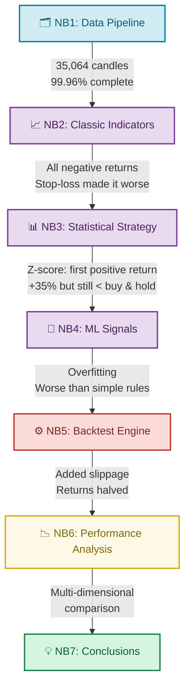
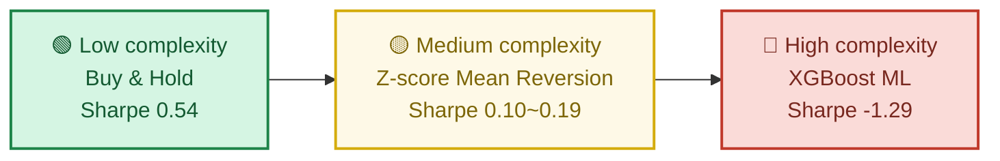
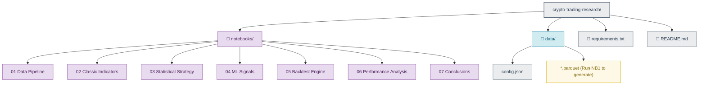
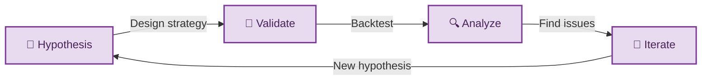

# 🔬 Crypto Trading Strategy Research

> From classic technical indicators to machine learning — validating trading hypotheses with data, and letting results override intuition.

[🇨🇳 中文版](./README_CN.md)

## 📌 Overview

This is not a project about "finding a profitable strategy". It's a systematic, data-driven research into **whether common trading strategies actually work**.

- Subject: BTC/USDT, 2021-2024, 35,000+ hourly candles
- Key finding: **Complexity does not equal profitability — simple rules beat ML, and buy-and-hold beat all active strategies.**

## 🧠 Research Flow



## 🔑 Key Findings

### 1. Complexity ≠ Effectiveness



### 2. Performance Overview

| Strategy | Source | Total Return | Sharpe | Max Drawdown | Trades |
|------|------|--------|----------|----------|----------|
| 🟢 Buy & Hold | Baseline | +222.7% | 0.54 | -77.2% | 0 |
| 🟡 Z-score (30d) | NB3 | +30.9% | 0.19 | -55.3% | 21 |
| 🟡 Z-score (7d) | NB3 | +17.4% | 0.10 | -50.6% | 143 |
| 🔴 MA Cross | NB2 | -35.2% | -0.24 | -76.4% | 362 |
| 🔴 Bollinger Bands | NB2 | -42.8% | -0.27 | -66.8% | 418 |
| 🔴 RSI | NB2 | -77.0% | -0.68 | -84.2% | 388 |
| 🔴 XGBoost | NB4 | -33.9% | -1.29 | -43.3% | — |

> Includes 0.1% fee + 0.05% slippage. NB4 test set only (2023.10-2024.12).

### 3. Three Counter-Intuitive Conclusions

**Stop-loss doesn't always protect you**  
In BTC's high-volatility environment, both fixed and trailing stop-losses increased losses due to frequent triggers.

**Trading frequency is a hidden killer**  
Within the same framework, 21 trades (Sharpe 0.19) vastly outperformed 143 trades (Sharpe 0.10).

**ML underperforms simple rules**  
XGBoost's top features (ma_ratio_24, zscore_168) matched hand-crafted rules exactly, yet couldn't outperform them.

## 📂 Project Structure



## 🚀 Quick Start

### Requirements
- Python 3.10+
- Access to Binance API (proxy may be needed in some regions)

### Setup

```bash
git clone <this repo>
cd crypto-trading-research
pip install -r requirements.txt
cd notebooks
jupyter notebook
```

> ⚠️ Run `01_数据获取与清洗.ipynb` first to generate data. All subsequent notebooks depend on it.  
> ⚠️ If you need a proxy for Binance, update the proxy config in NB1.

## 🧭 Methodology



Each notebook starts with a **decision log** documenting key choices and rationale:

| Notebook | Hypothesis | Result |
|----------|----------|----------|
| NB2 | Classic indicators capture BTC trends | ❌ All lost money — lagging signals + high volatility = frequent false breakouts |
| NB3 | Price reverts after deviation from mean | ✅ Z-score achieved first positive return, but low time-in-market |
| NB4 | ML multi-factor improves prediction accuracy | ❌ Severe overfitting, test accuracy ≈ random guess |
| NB5 | Slippage significantly impacts returns | ✅ Slippage cut Z-score returns nearly in half |

## 📊 Tech Stack

| Tool | Usage |
|------|------|
| ccxt | Exchange API for fetching candle data |
| pandas / numpy | Data processing and computation |
| matplotlib / seaborn | Visualization |
| scipy | Statistical analysis (normality tests, QQ plots) |
| XGBoost | Machine learning model |
| scikit-learn | Model evaluation, time series split |

## 📝 License

MIT License
