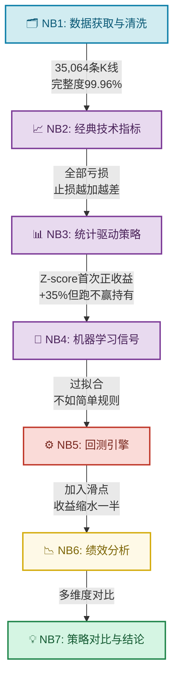
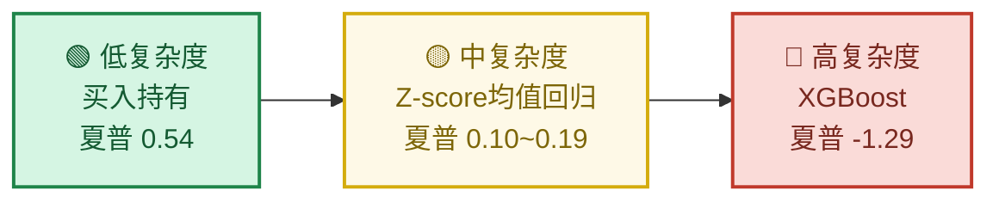
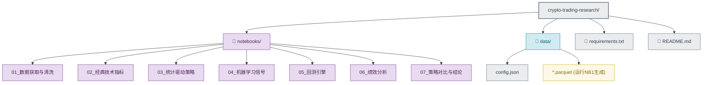
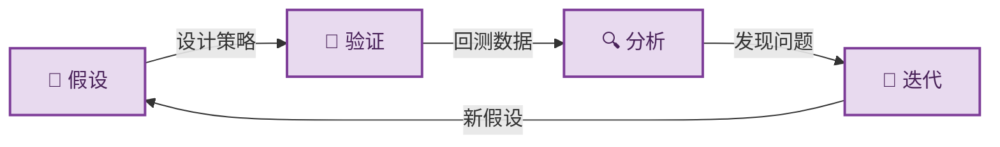

# 🔬 加密货币交易策略研究

> 从经典技术指标到机器学习，用数据验证交易假设，用结果否定直觉。

[🇬🇧 English Version](./README.md)

## 📌 项目简介

这不是一个"找到赚钱策略"的项目，而是一个**用数据驱动的方法系统性验证交易策略有效性**的研究。

- 研究对象：BTC/USDT，2021-2024年，35,000+ 条小时K线
- 核心发现：**复杂度和收益不成正比——简单规则优于机器学习，买入持有打败了所有主动策略。**

## 🧠 研究思维链



## 🔑 核心发现

### 1. 复杂度 ≠ 有效性



### 2. 策略绩效全景

| 策略 | 来源 | 总收益 | 夏普比率 | 最大回撤 | 交易次数 |
|------|------|--------|----------|----------|----------|
| 🟢 买入持有 | 基准 | +222.7% | 0.54 | -77.2% | 0 |
| 🟡 Z-score (30天) | NB3 | +30.9% | 0.19 | -55.3% | 21 |
| 🟡 Z-score (7天) | NB3 | +17.4% | 0.10 | -50.6% | 143 |
| 🔴 双均线交叉 | NB2 | -35.2% | -0.24 | -76.4% | 362 |
| 🔴 布林带突破 | NB2 | -42.8% | -0.27 | -66.8% | 418 |
| 🔴 RSI超买超卖 | NB2 | -77.0% | -0.68 | -84.2% | 388 |
| 🔴 XGBoost | NB4 | -33.9% | -1.29 | -43.3% | — |

> 含0.1%手续费 + 0.05%滑点，NB4仅测试集（2023.10-2024.12）

### 3. 三个反直觉的结论

**止损不一定保护你**  
在BTC的高波动下，固定止损和移动止损都因频繁触发反而加大了亏损。

**交易频率是隐性杀手**  
同一策略框架下，交易21次（夏普0.19）远好于交易143次（夏普0.10）。

**ML不如简单规则**  
XGBoost学到的最重要特征（ma_ratio_24, zscore_168）和手动规则完全一致，但无法比规则做得更好。

## 📂 项目结构



## 🚀 快速开始

### 环境要求
- Python 3.10+
- 需要能访问 Binance API（可能需要代理）

### 安装与运行

```bash
git clone <本仓库地址>
cd crypto-trading-research
pip install -r requirements.txt
cd notebooks
jupyter notebook
```

> ⚠️ 请先运行 `01_数据获取与清洗.ipynb` 生成数据文件，后续Notebook依赖此数据。  
> ⚠️ 如需代理访问Binance，请修改NB1中的代理配置。

## 🧭 研究方法论



每个Notebook开头都有**决策日志**，记录关键选择及其理由：

| Notebook | 核心假设 | 验证结果 |
|----------|----------|----------|
| NB2 | 经典技术指标能捕捉BTC趋势 | ❌ 全部亏损，信号滞后+高波动=频繁假突破 |
| NB3 | 价格偏离均值后会回归 | ✅ Z-score首次实现正收益，但持仓占比低 |
| NB4 | 多因子ML可以提升预测精度 | ❌ 过拟合严重，测试集准确率≈随机猜测 |
| NB5 | 滑点会显著影响策略收益 | ✅ 滑点吃掉Z-score策略近一半收益 |

## 📊 技术栈

| 工具 | 用途 |
|------|------|
| ccxt | 交易所API，获取K线数据 |
| pandas / numpy | 数据处理与计算 |
| matplotlib / seaborn | 可视化 |
| scipy | 统计分析（正态性检验、QQ图） |
| XGBoost | 机器学习模型 |
| scikit-learn | 模型评估、时间序列分割 |

## 📝 License

MIT License
